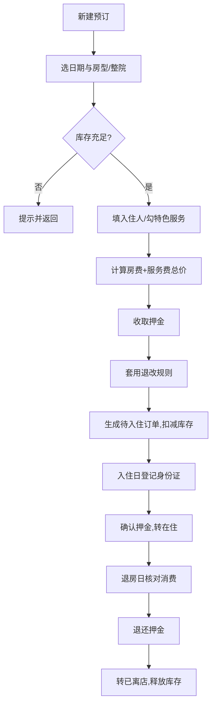

## 1. 产品概述

「山舍」农家乐与民宿预订管理系统，面向乡村农家乐及整院民宿经营者的后台管理工具，解决房型/包间与整院混租、平/旺/节假日差异化定价、预订下单与押金闭环、入住身份证登记与退房退押金、退改规则自动执行、特色增值服务勾选销售等核心经营痛点。目标用户为农家乐/民宿老板及前台运营人员，以一台电脑即可完成从房态、库存、订单到财务退押金的全流程闭环管理。

- 定位：单店全流程运营后台（桌面端优先），数据本地持久化、开箱即用
- 价值：用一套日历化、规则化的系统替代手工账本，杜绝超售、漏收押金、退改扯皮，提升接单效率与入住体验

## 2. 核心功能

### 2.1 用户角色

| 角色 | 进入方式 | 核心权限 |
|------|----------|----------|
| 经营者/前台 | 直接进入后台（本地单店） | 房型库存、订单、入住退房、押金、退改规则、特色服务全部读写权限 |

### 2.2 功能模块

1. **工作台**：当日关键指标、入住/退房待办、近7日房态、近期订单与收入趋势
2. **房型与包间管理**：维护房型/包间（单间模式）与整院（整院模式），差异化基准价、容量、设施
3. **房态日历**：按月日历查看每日可售库存，区分平日/周末/节假日价格，可标记节假日并调整当日库存
4. **预订管理**：订单列表与筛选，新建预订（选日期、房型/整院、入住人、特色服务、押金），自动套用退改规则
5. **入住退房**：入住登记身份证与实住人，收押金确认；离店核算、退还押金
6. **退改规则**：配置按入住前天数分档的退款比例与是否允许改期
7. **特色服务**：勾选销售 采摘、钓鱼、烧烤、棋牌、团餐 等增值服务及其单价

### 2.3 页面详情

| 页面名称 | 模块名称 | 功能描述 |
|----------|----------|----------|
| 工作台 | 顶部指标卡 | 今日入住数、今日退房数、在住数、可售数、今日应收、押金在押总额 |
| 工作台 | 待办事项 | 今日待入住、今日待退房列表，一键跳转办理 |
| 工作台 | 房态总览 | 近7日各房型可售/已订概览 |
| 工作台 | 近期订单 | 最近10条订单与状态标签 |
| 房型与包间管理 | 类型列表 | 房型/包间卡片，显示模式(单间/整院)、平日/周末/节假日价、容量、在售数量 |
| 房型与包间管理 | 新建/编辑 | 名称、模式、三种基准价、人数上限、数量、设施标签、描述 |
| 房型与包间管理 | 单元管理 | 单间模式下的具体房号/包间号维护；整院模式下的院子单元 |
| 房态日历 | 月历视图 | 按日显示每个房型可售数与当日单价，颜色区分平/旺/节假日 |
| 房态日历 | 节假日设置 | 标记某日为节假日并自定义名称，影响价格档位 |
| 房态日历 | 库存调整 | 针对某日关闭销售或临时增减可售库存 |
| 预订管理 | 订单列表 | 按状态/日期/客人筛选，显示房号、入住退房日、金额、押金、状态 |
| 预订管理 | 新建预订 | 选入住/退房日→选房型/整院→校验库存→填入住人→勾特色服务→计算总价→收押金→生成订单 |
| 预订管理 | 订单详情 | 订单全信息、退改规则、退订/改期操作与退款核算 |
| 入住退房 | 待办理列表 | 今日待入住、今日待退房分栏展示 |
| 入住退房 | 办理入住 | 选择订单→登记身份证号/姓名/人数→确认实住房号→确认收押金→状态转在住 |
| 入住退房 | 办理退房 | 选择在住订单→核对消费明细→退还押金（支持扣款）→状态转已离店 |
| 退改规则 | 规则列表 | 按入住前天数分档的退款比例规则（如>7天全额、3-7天退50%、<3天不退） |
| 退改规则 | 新建/编辑 | 规则名、生效房型、入住前天数区间、退款比例、是否允许改期 |
| 特色服务 | 服务列表 | 采摘、钓鱼、烧烤、棋牌、团餐 启停、单价、单位、描述 |

## 3. 核心流程

**新建预订并收押金流程**：经营者在「预订管理」选择入住/退房日期与房型/整院→系统按日期档位计算每晚单价并校验各日库存→填写入住人与联系方式→勾选特色服务（按数量计费）→系统汇总房费+服务费总价→收取押金（金额可调，默认=首晚房费）→套用退改规则→生成「待入住」订单并扣减对应日期库存。

**入住到退房闭环**：入住日→「入住退房」找到待入住订单→登记身份证与实住人数→分配具体房号→确认押金已收→订单转「在住」；退房日→「入住退房」找到在住订单→核对总消费→计算应退押金（可扣除损坏/超时等）→确认退还→订单转「已离店」并恢复/释放库存。

**退改执行**：订单详情点击退订→系统读取入住日与今日差值→匹配退改规则→计算退款比例与退款金额→二次确认后状态转「已取消」并释放库存；改期则校验新日期库存后迁移订单。

## 4. 用户界面设计

### 4.1 设计风格

- **风格方向**：「山野田园 · 质朴雅致」——以山林田园为灵感的有机自然风，配色取自土地、草木、麦穗与陶土，规避冷冰冰的后台蓝紫，营造温暖可信的经营工具气质
- **主色**：深林绿 `#2f4a37`（主操作/导航）；**强调色**：陶土橘 `#c9632f`（关键数据/押金/警示）；**点缀色**：麦穗金 `#d9a441`；**背景**：米麻纸色 `#f6f1e7`；**卡片**：暖白 `#fbf8f1`；**文字**：炭褐 `#2b2620`
- **按钮**：主按钮实心深林绿带微弱内阴影与圆角；次按钮描边陶土橘；危险操作(退订/扣款)陶土橘实心；标签为浅色底+对应色文字
- **字体**：标题用思源宋体 Noto Serif SC（衬线，质朴有温度）；正文与数据用思源黑体 Noto Sans SC（清晰易读）；数字金额用等宽特性呈现
- **布局**：左侧固定侧边栏导航 + 顶部页头 + 主内容区；内容以卡片网格为主，房态日历为月历表格；桌面优先，留白克制、信息密度适中
- **图标/emoji**：使用线性自然风格图标，特色服务以小型彩色徽标呈现（采摘🌾 钓鱼🎣 烧烤🔥 棋牌♟ 团餐🍲）

### 4.2 页面设计概览

| 页面名称 | 模块名称 | UI 元素 |
|----------|----------|----------|
| 工作台 | 指标卡 | 米纸背景上6张暖白卡，左侧色条+大号金额数字+趋势小字 |
| 工作台 | 待办区 | 双栏卡片（待入住/待退房），列表项含客人、房号、日期，右侧主操作按钮 |
| 房型与包间管理 | 类型卡片网格 | 每卡顶部模式标签(单间/整院)、名称宋体、三档价格横向并列、容量与数量、底部编辑/单元按钮 |
| 房态日历 | 月历表格 | 7列日历，每日格内列房型可售数+单价，节假日格右上角金点，周末浅绿底，节假日浅橘底 |
| 预订管理 | 订单表格 | 状态彩色标签、金额右对齐、行操作(详情/入住/退房/退订) |
| 预订管理 | 新建预订抽屉 | 右侧滑出分步表单：日期→房型→入住人→服务→费用汇总与押金 |
| 入住退房 | 办理面板 | 左订单列表，右办理表单(身份证输入、人数、房号下拉、押金确认) |
| 退改规则 | 规则表 | 分档条形可视化入住前天数区间与退款比例 |
| 特色服务 | 服务卡片 | 5张图标卡，启停开关、单价、单位输入 |

### 4.3 响应式

桌面优先（1280px+最佳），在中小屏自动收起侧边栏为图标栏，表格与日历保持横向滚动可读；触控操作放大点击区域。

### 4.4 3D 场景

本系统为数据后台，不涉及3D场景。
