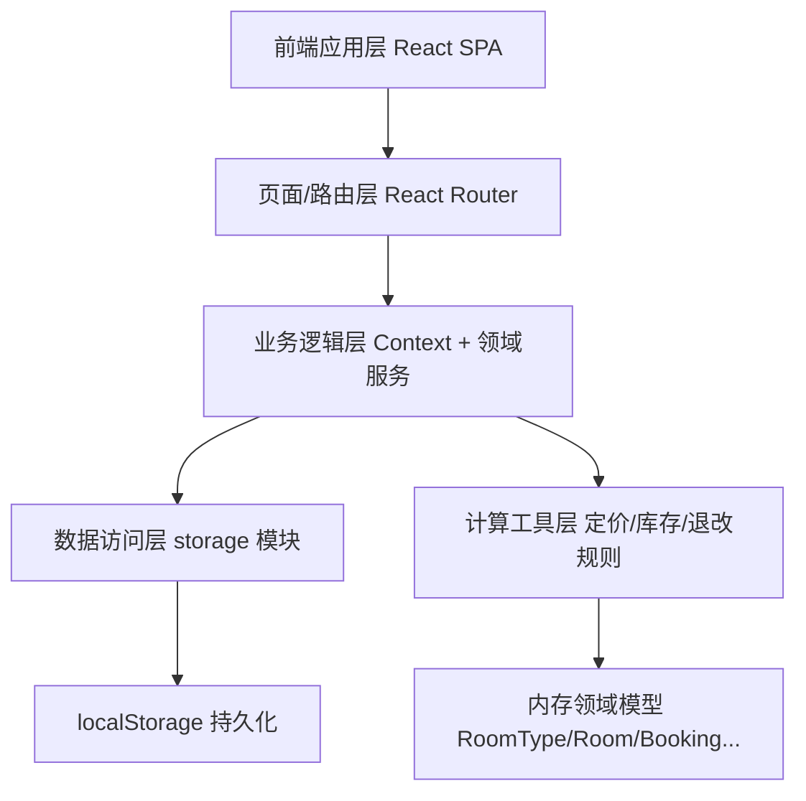
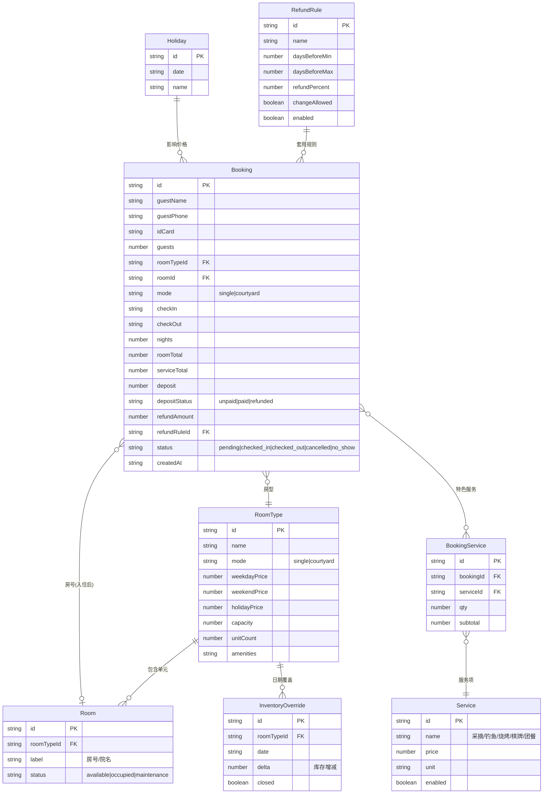

## 1. 架构设计

采用纯前端单页应用架构，数据通过 localStorage 持久化模拟后端存储，无需额外服务即可完整运行全部业务闭环。



## 2. 技术说明

- **前端**：React@18 + TailwindCSS@3 + Vite
- **初始化工具**：vite (`npm create vite@latest`)
- **路由**：React Router@6
- **后端**：无（纯前端）
- **数据**：localStorage 持久化 + 领域模型计算（定价、库存、退改），首次进入注入示例数据

## 3. 路由定义

| 路由 | 用途 |
|------|------|
| `/` | 工作台（指标、待办、近期订单） |
| `/rooms` | 房型与包间管理 |
| `/calendar` | 房态日历（库存与节假日） |
| `/bookings` | 预订管理（列表） |
| `/bookings/new` | 新建预订抽屉式表单 |
| `/bookings/:id` | 订单详情（退改执行） |
| `/frontdesk` | 入住退房办理 |
| `/rules` | 退改规则配置 |
| `/services` | 特色服务管理 |

## 4. API 定义

无后端 API。前端通过领域服务函数封装数据访问，统一从 `src/services` 暴露：

```typescript
interface DatePriceTier { kind: 'weekday' | 'weekend' | 'holiday'; price: number }

// 定价：根据日期 + 房型 + 节假日表 计算某日单价
function priceForDate(roomTypeId: string, date: string, holidays: Holiday[]): number

// 库存：查询某房型某日可售数（总单元数 - 已订单元数，整院为整院可售性）
function availabilityForDate(roomTypeId: string, date: string, bookings: Booking[], roomTypes: RoomType[]): number

// 订单总价：累加各晚单价 + 特色服务费
function calcOrderTotal(booking: DraftBooking, holidays: Holiday[], roomTypes: RoomType[], services: Service[]): { roomTotal: number; serviceTotal: number; total: number }

// 退改规则匹配：入住前天数 -> 退款比例
function matchRefundRule(checkInDate: string, today: string, rules: RefundRule[]): RefundRule | null

// 库存扣减/释放：下单扣减、取消/离店释放
function applyInventoryDelta(booking: Booking, delta: -1 | 1): void
```

## 5. 服务端架构

不适用（纯前端）。

## 6. 数据模型

### 6.1 数据模型定义



### 6.2 数据定义语言（等价 localStorage 结构）

以 TypeScript 接口定义并序列化为 JSON 存入 localStorage 键 `shanshe_db_v1`，包含集合：`roomTypes`、`rooms`、`inventoryOverrides`、`bookings`、`bookingServices`、`services`、`refundRules`、`holidays`。首次加载若为空则注入示例数据：

- 房型：山景双人间（单间,8间）、田园亲子房（单间,6间）、听雨院落（整院,1院,可整院出租）、观星阁（整院,1院）
- 节假日：含周末自动识别 + 若干示例节假日
- 退改规则：>7天全额退、3-7天退50%、1-3天退20%、<1天不退（均允许改期）
- 特色服务：采摘 38元/人、钓鱼 50元/人、烧烤 120元/次、棋牌 30元/场、团餐 80元/人
- 示例订单：覆盖待入住/在住/已离店/已取消各状态，便于演示
